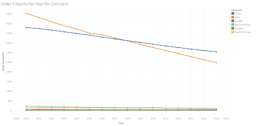
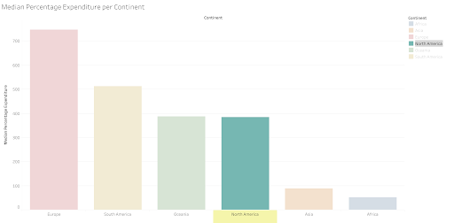
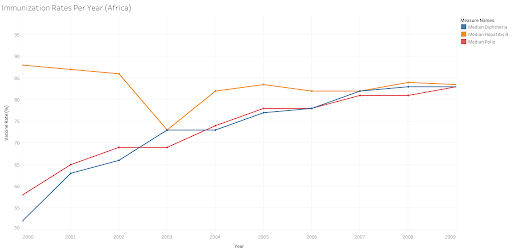
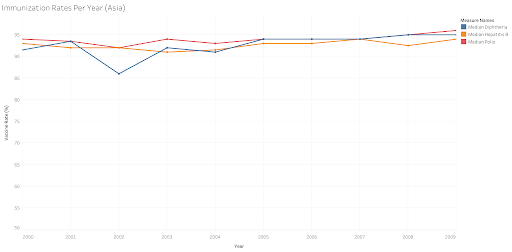
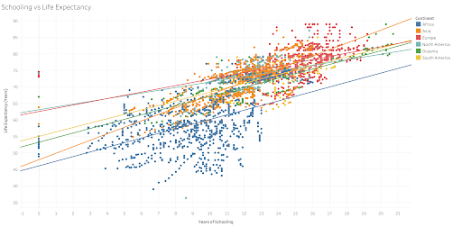

# Life Expectancy Analysis
Authors: Anbita Siregar, Elif Surucu, and Elijah Lopez

## Overview
This project analyzes various factors contributing to shortened lifespan using aggregated dated from the World Health Organization (WHO) and the United Nations. Worldwide policy leaders can use this analysis to understand the relationship between both government spending on healthcare and vaccination rates on children's deaths under 5 years old and to understand the relationship between years of schooling and total life expectancy.

## Business Problem
Governments around the world may be able to target key metrics to increase life expectancy for their citizens. Additional factors may increase quality of life and overall health and wellness.

## Data
This [data](https://www.kaggle.com/datasets/kumarajarshi/life-expectancy-who) comes from the [World Health Organization](https://www.who.int/) and the [United Nations](https://www.un.org/en/). It is a collection of health-related statistics and economic factors for 193 unique countries spanning from 2000-2015 (2,938 rows). This dataset includes variables such as life expectancy, mortality of various age groups, vaccination status for common diseases, population, GDP, and education among others.

## Methods
This project applied feature engineering to group countries by region (continent) and used descriptive statistics to explore relationships between life expectancy and various factors, including:
1. Government spending on healthcare as a percentage of GDP per capita and its impact on child mortality (deaths under 5 years old),
2. Vaccination rates and their influence on child mortality (deaths under 5 years old), and
3. Years of schooling and their correlation with total life expectancy.

## Results

### Child Mortality per Year by Continent

* Europe, North America, Oceania, and South America have death counts for children under below 300 per year.
* In Africa and Asia rates are declining, but still high.
* An interesting crossover happens between 2007-2009 where Asia’s death rate is less than Africa’s.

### Percentage of GDP per Capita Spent on Healthcare by Continent

* North America achieves low death counts in children under 5 while spending least on healthcare.
* Minimum healthcare spend should be 473% of GDP per capita in each country to match this outcome.

### Vaccination Rates for Common Diseases
#### In Africa

* Vaccination rates steadily increase over time, finally converging near 83%.

#### In Asia

* Vaccination rates begin and remain elevated throughout this time period at about 94%.

### Life Expectancy vs Schooling

* We see a strong, positive relationship between years of schooling and life expectancy for all continents.

## Conclusions
This analysis leads to three recommendations for increasing life expectancy around the world:

1. Each country should maintain a minimum spend of 473% of GDP per capita on healthcare.

2. Research additional factors leading to decreased child mortality in Asia and see if these can be implemented in Africa.

3. Raise minimum years of education requirements around the world.

## Next Steps
* Continue discussions with global leaders and policymakers to explore options for increasing funding and resources dedicated to health services.
* Investigate factors that led to the decrease in child mortality rates in Asia, including vaccination rates of other common diseases, population density, cultural influences, and education. More current data will also highlight the need for this continued research.
* Expand access to education by building more schools, especially in low-income countries, and increasing minimum education requirements.
* Focus on improving access to quality education, as the strong correlation between education and health outcomes highlights its importance in enhancing overall well-being. 

## For More Information
See the full analysis in the [Jupyter Notebook](https://github.com/anbitasiregar/life-expectancy-eda/blob/main/life_expectancy_eda.ipynb) or review this [presentation](https://docs.google.com/presentation/d/1tgLMF2Z2qtiIgKlLFMRrlvZFwhxVf69_nuTIf_D5-cc/edit?usp=sharing)

For additional info, contact the authors at:
Anbita Siregar | anbitasiregar@gmail.com
Elif Surucu | elif.src.34@gmail.com
Elijah Lopez | elijahlopez94@gmail.com